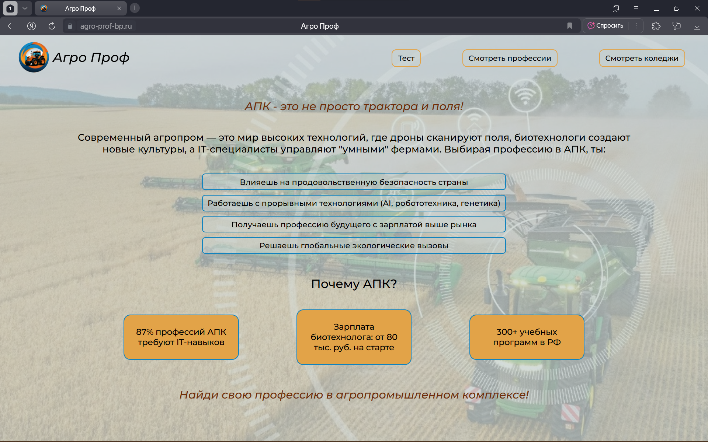

# Агро Проф
Сайт для выбора профессии в агропромышленном комплексе, созданный в рамках конкурса [Большая Перемена](https://большаяперемена.онлайн/)

## Просмотр
К сожалению хостинг, на котором работал сайт, не поддерживается. Но вы всегда можете посмотреть [скиншоты](#скриншоты) или [запустить сайт самостоятельно](#как-запустить-сайт-локально)!

## Описание проблемы
Российский АПК испытывает острую нехватку кадров (дефицит >200 тыс. специалистов), усугубляемую оттоком 60% выпускников аграрных вузов в другие отрасли. Основная причина – системный кризис профориентации: треть школьников выбирает профессию хаотично, а также молодёжь недостаточно информирована о перспективах агросектора. Решить проблему позволяет создание сайта: 62.5% россиян 18-30 лет используют интернет как основной источник информации; Исследования подтверждают эффективность простых онлайн-ресурсов, поэтому создание специализированного профориентационного сайта для АПК с лаконичным дизайном и узкой отраслевой направленностью решит данную проблему.

## Преимущества сайта

- ### Большой выбор профессий
    Сайт предоставляет широкий спектр профессий для изучения, а так же зарплятные ожидания.

- ### Большой выбор колледжей
    Сайт предоставляет широкий спектр колледжей для изучения нужных профессий. Список колледжей составлен не только по Москве, но и по регионам.

- ### Тест на профориентацию
    Сайт предоставляет 15 профессиональных вопросов по ключевым аспектам работы в АПК, которые позволяют определить ТОП-5 профессий, подходящих пользователю.

- ### Простой дизайн
    Позволяет эффективнее доносить информацию.

## Как запустить сайт локально
Сайт написан на фреймворке React. Для запуска сайта вам потребуется:
1. Установить необходимые зависимости: [Node.js](https://nodejs.org/en), [VS Code](https://code.visualstudio.com/).
2. Скачать zip-архив проекта с GitHub.
3. Распаковать архив и открыть папку проекта через VS Code.
4. Открыть терминал и выполнить следующие команды:

```PowerShell
# Установка всех необходимых пакетов
npm i

# Сборка сайта
npm run build

# Запуск сайта
npm start
```

5. После успешного запуска перейдите по ссылке http://localhost:3000.

Для остановки работы сайта достаточно, находясь в терминале, дважды нажать сочетание клавиш `Ctr+C`. Чтобы запустить сайт после этого, достаточно будет выполнить в терминале команду
```PowerShell
npm start
```

## Как запустить сайт на сервере
Здесь не будет подробной инструкции, однако вы можете найти всю необходимую информацию [на сайте](https://reg.cloud/support/cloud/oblachnyye-servery/ustanovka-programmnogo-obespecheniya/deploy-react-prilozheniya).

# Скриншоты



